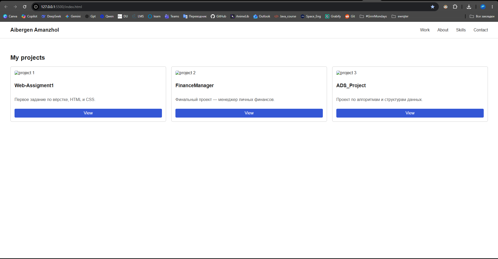
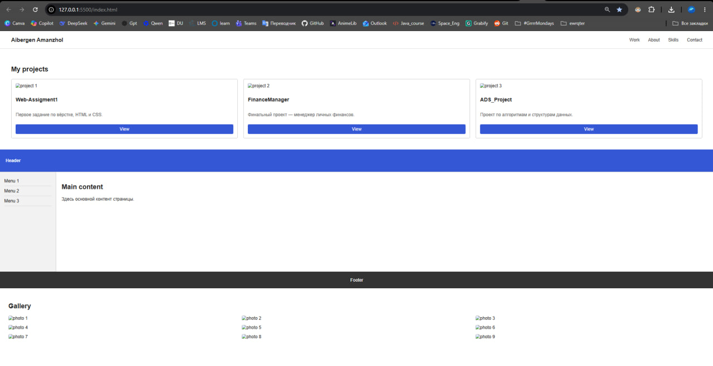
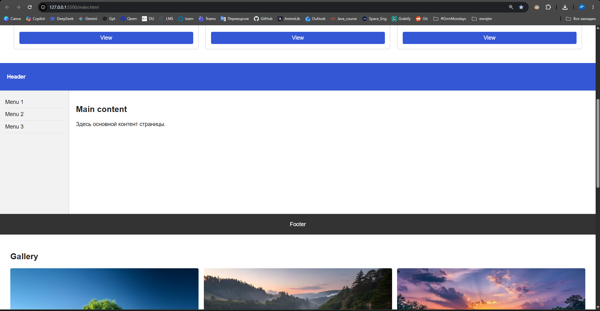
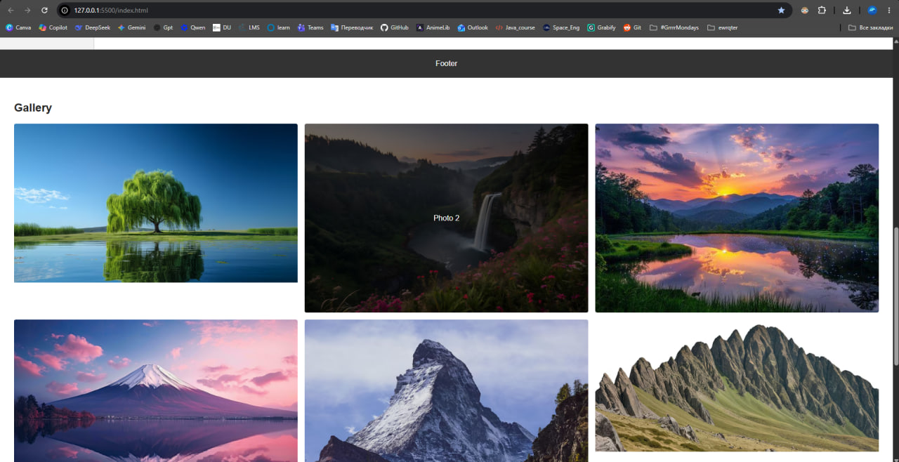
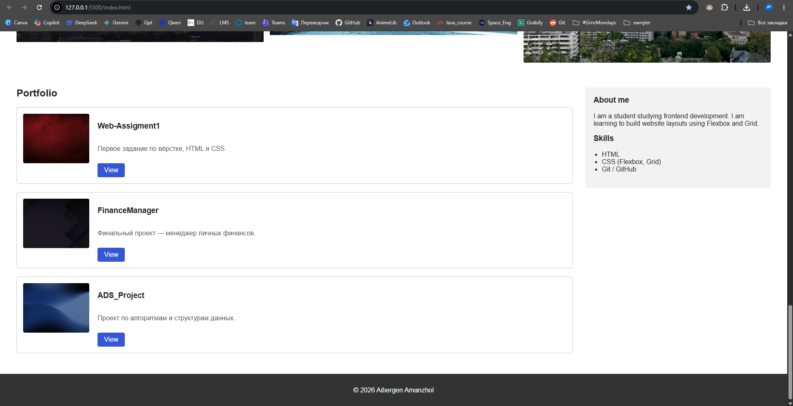

# Assignment 2 - Advanced CSS (Flexbox & Grid)

Name: Aibergen Amanzhol
Group: SE - 2538

## What is done

The assignment was split into 3 parts, 5 tasks total. All tasks are in one index.html file, styles are in style.css.

## Part 1. Flexbox

### Task 0 - Navigation Bar

Made a header with a logo on the left and a menu on the right. The header is a flex container, justify-content: space-between pushes the logo and the menu to opposite sides, align-items: center lines them up vertically.

Screenshot:

### Task 1 - Card Row

A row of 3 project cards (image, title, text, button). The .cards container is flex, cards have the same height because of align-items: stretch, gap is used between cards. On hover a shadow appears (hover effect).

Screenshot:

## Part 2. Grid

### Task 2 - Page Layout with Grid Areas

A layout with header, sidebar, main and footer made with grid-template-areas. Header and footer stretch across the full width, sidebar is on the left, main content is on the right.

Screenshot:

### Task 3 - Image Gallery

A gallery of 9 photos in a 3x3 grid (grid-template-columns: repeat(3, 1fr)), gap between photos. On hover a caption appears on top of the photo (opacity goes from 0 to 1).

Screenshot:

## Part 3. Flexbox + Grid

### Task 4 - Portfolio Page

Built a portfolio page: header with navigation on flexbox (same as Task 0), main section on grid - project list on the left, About/Skills block on the right. Inside each project card used flexbox to place the image and the text. Footer at the bottom, full width.

Screenshot:

## How I worked on it

First I figured out flexbox - made the navbar and the cards. Then moved to grid, grid-template-areas was harder to understand, looked it up on w3schools. At the end combined both in one page - the portfolio. Most time was spent on making the cards equal height and getting the hover caption in the gallery to work.

## Repository

GitHub: https://github.com/aibergen74-create/WEB_assignment2
